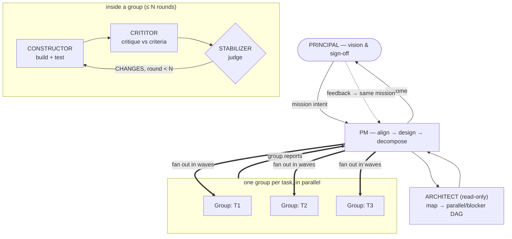

# mission-pipeline

A human-in-the-loop, multi-agent engineering workflow for [Claude Code](https://claude.com/claude-code). A PM agent aligns with you, decomposes work into missions and tasks, fans tasks out to parallel **groups** — each a bounded *build → critique → judge* loop — and nothing closes until you've tried the result and signed off.

Extracted from a working research-engineering deployment where it ran multi-wave missions with 10+ parallel task groups.

## Why

Running one coding agent in a loop doesn't scale past a handful of tasks, and unreviewed agent output doesn't deserve trust. This pipeline fixes both structurally:

- **Separate hands.** The agent that builds is never the agent that reviews, and neither is the agent that judges. Verdicts come with evidence.
- **Bounded loops.** Every task gets at most N rounds (default 3) of build↔critique before it *must* escalate to a human decision — no infinite self-revision.
- **Parallel without collisions.** A read-only Architect maps which tasks actually touch which files; tasks that collide never run in the same wave.
- **The human is the close.** Integration and green tests don't end a mission — your hands-on acceptance does. Feedback re-enters the same mission.

## The shape



| Role | Does | Never |
|---|---|---|
| **PM** | Aligns with you, owns the *how*, specs tasks, integrates, reports | builds, reviews |
| **Architect** | Reads the codebase → structural map → wave schedule (facts) | edits code, decides |
| **Constructor** | Builds + tests exactly to the task spec | redesigns, touches out-of-scope |
| **Crititor** | Evidence-backed verdict against the acceptance criteria | fixes the work itself |
| **Stabilizer** | The PM's judgment inside one group: accept / send back / escalate | moves goalposts, exceeds N rounds |
| **Researcher** *(optional)* | Adversarial external evidence before a decision | decides the question |

## Install

**As a Claude Code plugin (recommended — versioned updates):**

```
/plugin marketplace add ZhuoQiuMcgill/mission-pipeline
/plugin install mission-pipeline@mission-pipeline
```

**Manual (any setup):** copy `skills/mission-pipeline/` into your project's `.claude/skills/` (or `~/.claude/skills/` for all projects).

## Quickstart

In a project with the plugin installed, run:

```
/mission-pipeline:init
```

(Manual installs: tell Claude *"set up mission-pipeline"* instead.) Init is idempotent and safe in old projects with an established workflow — it creates the pipeline's folders, **briefly scouts your existing codebase and conventions** (read-only; it changes nothing about your current workflow), then runs a short setup interview pre-filled with what it found — you mostly veto proposals rather than answer questions. The result lands in `.claude/mission-pipeline/PROJECT.md` — the **only** file your project ever edits. Then give it a goal:

> mission: add rate limiting to the public API

Everything the pipeline produces — task specs, implementation reports, critiques, group reports — lands in a per-mission ledger under `.claude/mission-pipeline/ledger/`, outside your source tree (relocatable into `docs/` via PROJECT.md if you want it version-controlled).

## Design rules worth knowing

- **Engine vs. bindings.** The skill's files are the engine and are never edited in your project; `PROJECT.md` fills declared slots and may add rules but can't override the engine. Upgrades are drop-in; drift is detectable by `diff`.
- **Nine invariants** (separate hands, align-first, verdict ≠ judgment, bounded rounds, mandatory out-of-scope lists, undeclared deviation = automatic fail, one voice per group, Architect proposes / PM disposes, principal closes) are named in `SKILL.md`. Changing them is forking the methodology, not configuring it.
- **Missions, not tickets.** Every piece of work is a mission — a goal *plus your acceptance of it*. A one-line fix is a small mission; a redesign is a big one with waves.

## Releases

Semantic versioning. The plugin version, a `CHANGELOG.md` entry, and a git tag move together; the `version` field in `plugin.json` is the release gate — installed users only receive changes when it's bumped. Update with `/plugin marketplace update mission-pipeline` (plugin installs) or by re-copying `skills/mission-pipeline/` (manual installs) — your `PROJECT.md` and ledger are never touched by an upgrade.

## License

[MIT](LICENSE) © 2026 Zhuo Qiu
