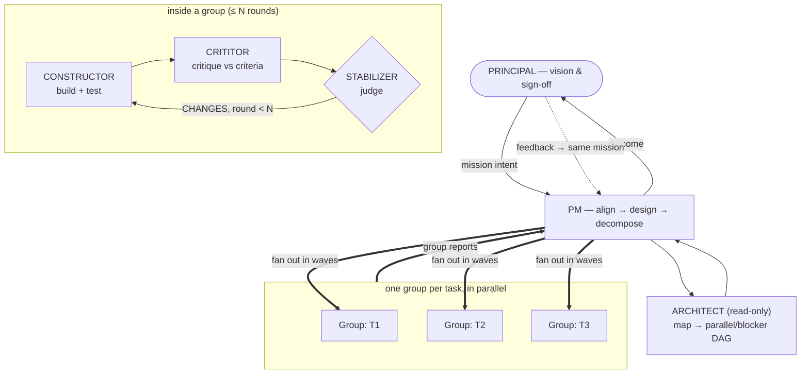

# mission-pipeline

A human-in-the-loop, multi-agent engineering workflow for [Claude Code](https://claude.com/claude-code). A PM agent aligns with you, decomposes work into missions and tasks, fans tasks out to parallel **groups** — each a bounded *build → critique → judge* loop — and nothing closes until you've tried the result and signed off.

Extracted from a working research-engineering deployment where it ran multi-wave missions with 10+ parallel task groups.

## Why

Running one coding agent in a loop doesn't scale past a handful of tasks, and unreviewed agent output doesn't deserve trust. This pipeline fixes both structurally:

- **Separate hands.** The agent that builds is never the agent that reviews, and neither is the agent that judges. Verdicts come with evidence.
- **Bounded loops.** Every task gets at most N rounds (default 3) of build↔critique before it *must* escalate to a human decision — no infinite self-revision.
- **Parallel without collisions.** A read-only Architect maps which tasks actually touch which files; tasks that collide never run in the same wave.
- **The human is the close.** Integration and green tests don't end a mission — your acceptance does: in person (sign-off mode), or by a standing delegation you ratified, with every closure listed for you to repudiate item by item (auto mode). Feedback re-enters the same mission.

## The shape


```mermaid
flowchart TD
    P(["PRINCIPAL — vision & sign-off"]) -->|mission intent| PM["PM — align → design → decompose"]
    PM --> A["ARCHITECT (read-only)\nmap → parallel/blocker DAG"]
    A --> PM
    PM ==>|fan out in waves| G1 & G2 & G3
    subgraph WAVE ["one group per task, in parallel"]
        G1["Group: T1"]; G2["Group: T2"]; G3["Group: T3"]
    end
    WAVE ==>|group reports| PM
    PM -->|outcome| P
    P -.->|"feedback → same mission"| PM

    subgraph GROUP ["inside a group (≤ N rounds)"]
        C["CONSTRUCTOR\nbuild + test"] --> R["CRITITOR\ncritique vs criteria"]
        R --> S{"STABILIZER\njudge"}
        S -->|CHANGES, round < N| C
    end
```

Since 1.0.0, a **calibration cell** also sits at every wave boundary (missions with two or more waves): a deliberately starved Calibrator and a deliberately fed Challenger argue the wave's deliveries against the frozen mission Charter before an arbiter — ALIGNED launches the next wave, DRIFT halts only the affected fan-out.

| Role | Does | Never |
|---|---|---|
| **PM** | Aligns with you, owns the *how*, specs tasks, integrates, reports | builds, reviews |
| **Architect** | Reads the codebase → structural map → wave schedule (facts) | edits code, decides |
| **Constructor** | Builds + tests exactly to the task spec | redesigns, touches out-of-scope |
| **Crititor** | Evidence-backed verdict against the acceptance criteria | fixes the work itself |
| **Stabilizer** | The PM's judgment inside one group: spot-checks evidence, then accept / send back / escalate | moves goalposts, exceeds N rounds |
| **Calibrator** | Starved drift detector at wave boundaries: sees only the frozen Charter, the wave's deliveries, and mechanical metrics; files trend/contradiction accusations | reads specs, critiques, or PM narrative; decides |
| **Challenger** | Fed defender: answers each accusation with written authorization — a Charter line, a ratified amendment, a recorded decision — or concedes | discharges with rhetoric or derived documents |
| **Researcher** *(optional)* | Adversarial external evidence before a decision | decides the question |
| **Auditor** *(optional)* | One arms-length read at close: does the integrated result deliver the written goal? | re-judges tasks, decides |

## Install

**As a Claude Code plugin (recommended — versioned updates):**

```
/plugin marketplace add ZhuoQiuMcgill/mission-pipeline
/plugin install mission-pipeline@mission-pipeline
```

**Manual (any setup):** copy `skills/mission-pipeline/` into your project's `.claude/skills/` (or `~/.claude/skills/` for all projects).

## Quickstart

In a project with the plugin installed, run:

```
/mission-pipeline:init
```

(Manual installs: tell Claude *"set up mission-pipeline"* instead.) Init is idempotent and safe in old projects with an established workflow — it creates the pipeline's folders, **briefly scouts your existing codebase and conventions** (read-only; it changes nothing about your current workflow), then runs a short setup interview pre-filled with what it found — you mostly veto proposals rather than answer questions. The result lands in `.claude/mission-pipeline/PROJECT.md` — the **only** file your project ever edits. The only environment requirement: **Python ≥ 3.8** on the path (stdlib only, zero packages) — init verifies it up front, so a missing interpreter fails at setup, never mid-mission. Then give it a goal:

> mission: add rate limiting to the public API

Everything the pipeline produces — task specs, implementation reports, critiques, group reports — lands in a per-mission ledger under `.claude/mission-pipeline/ledger/`, outside your source tree (relocatable into `docs/` via PROJECT.md if you want it version-controlled).

## The substrate

The paper trail runs on a deterministic substrate with three layers of authority:

1. **`ledger/events.jsonl`** — an append-only journal, authoritative for every state transition, *including refused operations*. History is physically unrewritable.
2. **`ledger/mp.db`** — SQLite, derived and disposable: invariants become constraints (round caps, registry uniqueness, undisposed flags block close), and the whole database is rebuildable from the journal at any time.
3. **Markdown artifacts** — unchanged, authoritative for judgment prose. Arguments and verdicts stay in prose; the substrate only makes their state transitions facts.

The substrate is **agent-internal**: the agents operate it, and you never run a command — that is invariant 12, *the principal converses; agents operate*. You talk to the PM; the machinery is the agents' problem.

Since 1.1.0 nothing is typed twice: **agents write a document once and submit it with one call** (`mp seal`); the substrate parses the document and derives every record — evidence, flags, verdicts, rounds, citations. The rules run at that one step nobody can skip, so a document that breaks one is refused by name and fixed, and the ledger can never disagree with the documents it came from. Test runs are recorded once and cited by id; any record can be retired and rules only read live ones.

## Design rules worth knowing

- **Engine vs. bindings.** The skill's files are the engine and are never edited in your project; `PROJECT.md` fills declared slots and may add rules but can't override the engine. Upgrades are drop-in; drift is detectable by `diff`.
- **Thirteen invariants** (separate hands, align-first, verdict ≠ judgment, bounded rounds, mandatory out-of-scope lists, undeclared deviation = automatic fail, one voice per group, Architect proposes / PM disposes, principal closes, reality closes the evidence, flags route, the principal converses — agents operate, echoes are not evidence) are named in `SKILL.md`. Changing them is forking the methodology, not configuring it.
- **Contracts stay armed.** Task-level verification may be narrowed for speed, but every mission must pass one full-scope closing gate before sign-off; out-of-frame observations route verbatim to the PM and each gets an explicit disposition; ratified standing contracts (`ledger/CONTRACTS.md`) bind every task whether or not a spec restates them. All three rules were mined from a seven-mission production ledger where their absence let a fully-accepted mission ship 13 latent test failures.
- **The Charter is the anchor.** Each mission freezes its goal — your verbatim words plus read-backs you confirmed — before the mission's document web exists; only you can amend it, in conversation. Drift is judged against the Charter, never against what the paperwork has come to believe.
- **Echoes are not evidence.** Agreement among derived documents adds zero evidential weight; every acceptance stands on at least one reality-anchored or fixed-point anchor, and reality anchors bind to the exact source state that produced them.
- **Derive, don't declare.** Facts (versions, hashes, citations, rounds) are never typed by an agent — they are read from the documents. Only judgments are written by hand, once. A fact typed by a model is a defect by construction.
- **Two closure modes, declared once.** Like a permission mode: `sign-off` (you accept each mission) or `auto` (the PM closes when the gate holds; you repudiate from the acts list). What still stops in both: a drift verdict, the suspicion ratchet, a Charter amendment. The PM never chooses the mode; a mission never stalls on procedure.
- **Missions, not tickets.** Every piece of work is a mission — a goal *plus your acceptance of it*. A one-line fix is a small mission; a redesign is a big one with waves.

## Releases

Semantic versioning. The plugin version, a `CHANGELOG.md` entry, and a git tag move together; the `version` field in `plugin.json` is the release gate — installed users only receive changes when it's bumped. Update with `/plugin marketplace update mission-pipeline` (plugin installs) or by re-copying `skills/mission-pipeline/` (manual installs) — your `PROJECT.md` and ledger are never touched by an upgrade. From 1.0.0 on, breaking changes to the binding contract (PROJECT.md slots), the agent-internal `mp` command surface, or the substrate schema imply a major version bump.

## License

[MIT](LICENSE) © 2026 Zhuo Qiu
