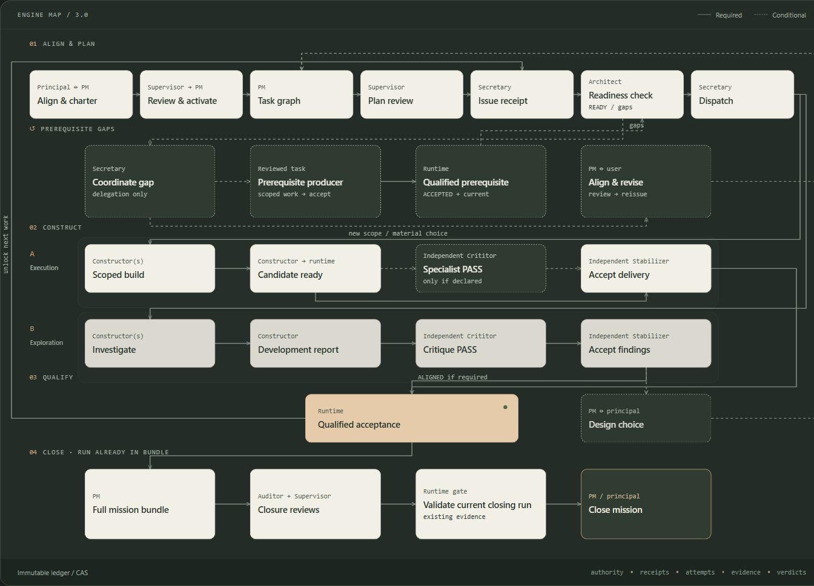

# mission-pipeline

A traceable engineering workflow with PM user alignment, delegated coordination, prerequisite inspection, scoped construction and independent acceptance. Execution and exploration use different construction loops.

**Version 3.0.0** adds a shorter execution loop and keeps the traceable ledger,
PM user alignment, independent planning and final audit. Schema 4 stays readable;
historical tasks keep their original policy.

[](docs/workflow-3.0.jpg)

[Interactive workflow HTML](docs/workflow-3.0.html) — download and open in a browser for route filters, stage details and recovery paths.

## 3.0.0 — execution and exploration

PM turns user requirements into a prioritised dependency graph. Each subtask is
execution, exploration or a future milestone; a parent can contain both kinds of
work. A delegated Secretary coordinates routine progress and sends important
design choices to PM. PM retains complete ledger access on demand.

For execution, Architect checks actual environment prerequisites, scoped Constructors
work in parallel, and one independent Stabilizer checks the integrated delivery.
Exploration keeps the full development, critique and acceptance chain. Only current
accepted outputs unlock dependent work; a recorded historic acceptance can go stale.
Priorities and routine coordination do not invalidate the executable contract.

Read the [3.0 operating contract](skills/mission-pipeline/references/fast-mode.md)
for receipt fields and the complete sequence. Full verification definitions must
exist before executable review; future milestones can remain undecided. Replace
the whole installed skill package to upgrade. Existing project bindings and ledger
history are preserved. New work selects its route explicitly through `work_type`.

The principal sets the direction and reserved conditions. The PM may choose and revise methods inside a recorded delegation. A proposed Charter becomes active only after an independent semantic review; a PM-written prohibition does not silently become a principal contract. Mandatory counterexamples immediately block affected positive uses, with bounded repair and independent contest paths. Mandatory closure auditing, current execution evidence and actual delivery inputs are part of the same gate.

## 2.1.0 — what changed for operators

Version 2.0.0 shipped a correct engine that a live deployment could get stuck in. 2.1.0 repairs the paths where that happened. No schema change, no new record shape, and existing 2.0 ledgers keep working.

- **Nothing stalls by procedure any more.** Exhausting the two review rebases on a case no longer freezes the mission: the case closes as `TARGET_REPLACED` and a successor case carries the same scope and counterexample forward. The 12-call correction budget is per case rather than per mission.
- **Review deadlines match how long local agents actually take.** `review_deadline_seconds` defaults to one day in local mode and 300 seconds in managed mode. An expired screening or contest job auto-resumes in place while a resume remains, with no separate `jobs.expire` step.
- **Dismissal is contestable and cannot pre-empt a contest.** `case.resolve` refuses `CONTEST_PENDING` while an independent decision is open, and refuses `SCREENING_REQUIRED` for a dismissal nobody screened. Every reporting role can open the one contest a case allows.
- **Honest execution labels.** A local run records `assurance="local-execution"`. It freezes inputs, captures logs and outputs, and does not contain the process. The old `local-controlled-execution` label is still accepted on existing ledgers.
- **`controller` is internal.** `--actor controller` and `MP_ACTOR=controller` are refused from the CLI, the adapter and the bridge, so a hand-written run can no longer close a mission.
- **New disposals and continuity.** `obligation.cancel` withdraws a required outcome under a defer grant. `legacy.accept` settles an obligation that a migrated 1.2 mission already delivered, so an open mission upgrades mid-flight instead of redoing its chain.
- **Closed outcome sets.** `audit.record` takes PASS, FINDINGS or INPUT_INCOMPLETE; `close.review` takes PASS, FAIL or INPUT_INCOMPLETE; a report for a task with obligations needs a real criteria table.
- **Writer identity survives a rename.** The identity now hashes a token in `<config dir>/mission-pipeline/writer-id` instead of the hostname, and `maintenance takeover --confirm <project id>` lets the principal reclaim a ledger whose owner environment is gone.
- **Documentation is operational again.** `skills/mission-pipeline/references/walkthrough.md` is a complete worked mission, request by request, plus the mid-mission 1.2 upgrade and the recovery commands. Role files say which actions each seat submits and which refusals it will meet. Nine new templates cover plan review, close review, screening, case resolution, contest decisions, recovery permits, deferral, cancellation and legacy acceptance.

**Upgrade path.** Replace the installed skill directory wholesale; project bindings and ledgers are untouched. Then, in order: re-register Windows/WSL bridge mappings before the first cross-platform request, run `doctor`, and for a 1.2 ledger run `migrate --plan` and read it before `migrate`. Part 2 of the walkthrough is the mid-mission upgrade in full. Nothing in 2.1.0 rewrites history, and `rollback` remains available only before the first v4 business transition.

**Honestly.** Local mode is the mode this repository can run end to end. Its data and state checks are real; its role labels are self-asserted, so separation of seats depends on the operator spawning genuinely separate agents, and local execution is not a sandbox. Managed mode is experimental: the bubblewrap isolation, the broker and the JSONL protocol are implemented and tested, but no model driver ships here, so a managed deployment needs a trusted transport somebody else writes.

## Install and supported environments

Install the plugin using the existing marketplace entry, or copy the **entire** `skills/mission-pipeline/` directory. Keep `scripts/mp`, `scripts/mp_runtime/`, `scripts/mp.ps1`, roles, templates and references together. Copying the former single `mp` file is insufficient.

- Native Windows or POSIX CLI: Python 3.12 or newer, standard library including SQLite, and Git for Git-backed source identity. Local mode enforces data and workflow checks; role labels are self-asserted and local execution is not contained.
- Linux/WSL managed runner (**experimental**): Python 3.12 or newer, Git and working `bubblewrap` user, mount, PID and network namespaces. The controller probes the actual allowlisted sandbox. Tested interpreters are Windows Python 3.12.7 and Ubuntu WSL Python 3.14.4.
- Managed roles receive only private broker tools through a trusted JSONL model transport, which this repository does not supply. A transport with parallel unrestricted shell or filesystem tools cannot claim managed isolation. Missing host capability is an error, never an automatic downgrade.
- Product dependencies belong to an explicitly registered canonical interpreter or profile. A copied venv is not assumed valid. Managed Linux venvs may be mounted as a specific read-only runtime root; Windows venvs cannot be reused as Linux environments.

Run `/mission-pipeline:init`, which follows [setup](skills/mission-pipeline/references/setup.md). Agents operate the machinery; the principal supplies decisions in conversation. Existing authorization remains valid and is not requested again for each tool call.

```text
python <absolute-skill>/scripts/mp --root <absolute-project> capabilities
python <absolute-skill>/scripts/mp --root <absolute-project> init
python <absolute-skill>/scripts/mp --root <absolute-project> doctor
```

On Windows, an explicit Python executable or `scripts/mp.ps1` is supported. Requests with arbitrary text use a UTF-8 JSON file or stdin, never a shell command assembled from that text.

## Full exploration and historical workflow

1. Record original principal input and scoped grants through the trusted ingress, or with clearly marked local provenance.
2. Create an intake, propose a candidate, obtain `root.review`, then atomically `root.activate`.
3. Record PM choices, goal-linked obligations, feasible tasks, explicit input, write and output paths, and verification requirements. Obtain a plan review and admission.
4. Constructor uses `work.write` for authorized product files and `run.execute` for verification. Runs freeze explicit inputs, capture logs in CAS and preserve declared output artifacts.
5. Crititor and Stabilizer read the actual inputs and submit separate reports. PASS, ACCEPTED, dispatch, claim, integrate, consume and close recheck current scoped barriers and evidence.
6. A mandatory counterexample atomically creates its screening job and barrier. Recovery permits allow bounded repair within existing authority. Mandatory Auditor disagreement automatically starts one independent Contest, and its result applies directly.
7. Satisfy the canonical closing run, build the complete immutable delivery bundle, and obtain the mandatory Auditor and Supervisor closure reviews. Closure validates the existing run under a valid principal decision or delegated close permission; a later run requires refreshed bundle and reviews. An authorized deferral or cancellation keeps its true gap and responsible owner.

New routed work uses the [receipt sequence](skills/mission-pipeline/references/fast-mode.md). The full historical worked sequence is [walkthrough](skills/mission-pipeline/references/walkthrough.md); shared authority, role transport and recovery commands are in [runtime-v4](skills/mission-pipeline/references/runtime-v4.md). Old free-form CLI commands cannot bypass schema-4 gates.

## Storage, migration and recovery

Schema 4 uses checksummed event envelopes in `ledger/segments/`, immutable blobs, a runtime manifest, an explicit writer-environment owner and a derived `mp.db`. A durable journal append is a committed operation even if SQLite subsequently fails: retry the same request id to recover its unique receipt. `doctor` distinguishes storage, semantic overlays and workflow holds; `rebuild` derives state again without replacing an open SQLite inode.

`migrate --plan` inspects a legacy ledger without changing it and now also reports the acceptances recoverable from sealed GroupReports. `migrate` preserves the original journal and documents, freezes the old writer, replays the released dispatcher, and installs semantic overlays plus calibration-release history before READY. Open scopes require explicit `legacy.adopt`, and an obligation the legacy mission already delivered is settled with `legacy.accept` as `legacy-recorded` history. Closed missions remain closed. `rollback` is available only before the first v4 business transition and preserves retired v4 evidence.

A ledger has one writer environment, and Windows and WSL locks are not interoperable. Use the WSL JSON bridge, or the explicit `maintenance handoff` and `maintenance accept` epoch protocol. `maintenance recover` repairs an interrupted bootstrap in its owner environment; `maintenance takeover --confirm <project id>`, as the principal, reclaims a ledger whose owner environment is unreachable. The writer-identity token lives in `<config dir>/mission-pipeline/writer-id`, outside the ledger, so archive it alongside. [Setup](skills/mission-pipeline/references/setup.md) explains these boundaries.

## Validation and compatibility

The released-schema regression entry points (`m1_smoke`, `m1_acceptance`, `m2_lint` through `m7_runs`) explicitly select frozen v3 compatibility. That compatibility path refuses every ledger carrying a v4 owner or manifest. The remaining suites exercise the normal v4 path, the managed role protocol, source and authority gates, historical migration and Windows/WSL environments.

Two entry points depend on data that is not in this repository, because it is real field evidence kept out of version control. They **skip** rather than fail when that data is absent: `m1_acceptance` exits 0 with `SKIP` when the corpus is missing, and `m9_migration` reports a skip for its real-ledger test while still running a synthetic v3-to-v4 fixture that builds a legacy ledger, migrates it, adopts the scope, accepts a legacy obligation and closes under v4. A clean checkout therefore runs the public suite anywhere.

`MP_COMPAT_V3=1` is a compatibility and historical regression switch, not the recommended product entry. Existing field adapter evidence is preserved; the supported replacement is `mp_runtime.field_adapter`, which uses structured requests, read-only queries and fenced publication.

## Versioning

Changes to the command, contract or schema require a major version. The plugin manifest is the installation and update metadata source; the changelog and release tag carry the same version. Release assets are available on [GitHub Releases](https://github.com/ZhuoQiuMcgill/mission-pipeline/releases).

[MIT](LICENSE) © 2026 Zhuo Qiu

The validation inventory is the 27 entry points from `tests/m1_*.py` through `tests/m26_*.py`: released v3 compatibility, normal v4 gates, real managed recovery and canonical adapter protocol, public CLI lifecycle, dual-environment and path boundaries, locked local dependency repair, current review inputs, cross-mission contracts, calibration dependencies, bounded run recovery, field ledger continuity, mixed receipt routing and qualified migration. Run all entry points on native Windows and WSL; managed-only suites use the actual Windows-to-WSL transport from their native entry. Source and evidence manifests determine which exact version a result validates.
