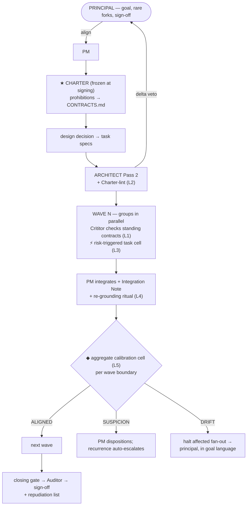

# Design Doc — Calibration Architecture & Deterministic Substrate

- **Category:** DesignDoc · **Date:** 2026-08-31 · **Version:** v03
- **Author:** Zhuo Qiu, with Claude (design session 2026-08-31)
- **Status:** Approved (Zhuo Qiu, 2026-08-31) — released as v1.0.0
- **Covers:** release **v1.0.0** — substrate + evidence law + calibration architecture, one release, gated milestones

## Revision History

| Date | Version | Change |
|---|---|---|
| 2026-08-31 | v01 | Initial draft from the design session. |
| 2026-08-31 | v02 | Principal's ruling: single v1.0.0 release replaces the v0.4.0/v0.5.0 split — the split's real content (build order, validation order, dogfood-before-freeze) survives as gated milestones (§11); big-bang risk row added (§12); §13 context updated. |
| 2026-08-31 | v03 | Ratified — §13 defaults stood unvetoed. Built and released as v1.0.0: M1–M3 mechanical gates green (117 checks); the "≥1 dogfooded mission before freeze" gate deferred to the first field deployments by the principal's decision (§11, *Deviation at release*). |

---

## 1. Problem and evidence

Long missions drift. The seven-mission DIVRA ledger (Week 21–27, 433 artifacts) shows the
three concrete forms:

1. **Monotone drift by legal steps.** Full-suite verification narrowed 100% → 0% across six
   missions; every individual step was contractually legal. No per-step check can see this —
   only the trend can.
2. **Record decay through summarization.** A declared evidence-identity risk decayed
   Constructor → "Notes, non-blocking" → "declared and non-blocking" → absent. Every seat
   compliant; the record was progressively rewritten until the risk vanished.
3. **Sub-semantic drift with no diff.** CRLF checkout drift changed byte-addressed hash
   inputs while `git status` read clean. Semantically coherent documents sat on mechanically
   drifted bytes; no seat was positioned to see it.

Two structural causes:

- **Nothing checks the checker.** Every existing check checks the *work*. The two cold reads
  sit at t=0 (Architect Pass 2) and t=end (Auditor). In between, only the PM — the
  longest-lived context, subject to compaction, and therefore the primary drift source — and
  it is unaudited mid-mission.
- **Circular corroboration.** N documents with one common ancestor are 1 root + N−1 echoes,
  but every reader (LLMs especially — coherent context captures the reader's frame) counts
  documents, not roots. Coherence launders error: reading *more* of a wrong-but-consistent
  web makes the error *less* visible, not more.

## 2. Design principles (settled in session)

| # | Principle |
|---|---|
| P1 | **The Charter is the calibration basis.** The goal settled between principal and PM, frozen by signature before the mission's document web exists. Only the principal amends it. |
| P2 | **Written authorization or it is drift.** A divergence from the Charter without a principal-anchored written authorization *is* drift, by definition. (Invariant 6 — undeclared deviation = fail — lifted from spec level to goal level.) |
| P3 | **Asymmetric information, fixed direction: the detector is starved, the defender is fed.** The drift detector must not inherit the web's frame; the defender discharges false positives with documents, not rhetoric. |
| P4 | **Each defense sits where its question is well-posed and cheap.** Prohibitions per task (standing contracts), contradictions at spec time (lint), aggregate drift at wave boundaries (the cell), prevention at the source (PM re-grounding). |
| P5 | **Echoes are not evidence.** Agreement among derived artifacts adds zero evidential weight; every acceptance stands on at least one non-derived root. |
| P6 | **The principal converses; agents operate.** Zero commands in the principal's contract. (Candidate invariant 12.) |
| P7 | **Judgment in prose; determinism in scripts; derived state is disposable.** The journal is authoritative for events, the DB is a rebuildable view, markdown is authoritative for judgment. |

## 3. Architecture overview



| Layer | Defense | Where | Catches | Cost |
|---|---|---|---|---|
| L1 | Charter prohibitions ratified into standing contracts at signing | every task, every round | slice-judgeable violations | free (Crititor already checks the registry) |
| L2 | Architect Pass 2 Charter-lint | before fan-out | spec/criteria contradicting the Charter | one lint row, zero sunk cost |
| L3 | Risk-triggered task-level calibration cell | on trigger only | delivery-level divergence in high-risk tasks | targeted |
| L4 | PM re-grounding ritual | every wave boundary | drift *production* (compaction) — the only preventive layer | near zero |
| L5 | Aggregate calibration cell (main force) | every wave boundary | monotone narrowing, task-set ≠ goal | one cell per wave |
| — | Auditor (existing) | before sign-off | absolute coverage, frame risks | unchanged |

Rationale for the weight distribution (from the session's deep review): per-task
post-build calibration is ill-posed for a starved reader (positive goal content is only
judgeable against the whole; only prohibitions are slice-judgeable — and those are exactly
what standing contracts already own), sits at the most expensive detection point, and its
modal-ALIGNED output breeds the same alarm fatigue that decayed flags in the production
ledger. The adversarial three-seat team therefore lives at the aggregate level, where the
question is well-posed, the count is per-wave, and the actual production escapes occurred.

## 4. The Charter

**Scope:** one Charter per mission, at the mission folder root. It complements — never
replaces — PROJECT.md (project bindings) and CONTRACTS.md (standing invariants).

**Content:**

1. **The principal's own words** — verbatim quotes from the alignment conversation.
2. **Confirmed read-backs** — the PM's compiled statements the principal confirmed.
   On conflict, the principal's own words govern.
3. **Prohibitions** — "never X" content. At signing, these are ratified into
   `CONTRACTS.md` in the same conversational act (zero extra principal interaction) and
   bind every task from wave 1.
4. **Priorities / tradeoffs** — e.g. "correctness over speed." Behave like soft
   prohibitions; slice-judgeable.
5. **Amendment ledger** — every change: who, when, the principal's verbatim confirming
   words, the read-back reference.

**Honest epistemics:** the Charter is partially a PM compilation with a principal
signature. Its guarantee is not "PM-free" but "**frozen after signing**" — amendment
requires the principal, so the web cannot rewrite its own anchor.

**Lifecycle:** drafted during alignment → sealed (`mp charter seal`) before decomposition →
amended only via the conversational chain (§8) → every amendment marks specs citing the
prior version as stale (mechanical propagation check). A mission may not fan out without a
sealed Charter. Small-mission degradation: the Charter is still mandatory but may be a
paragraph — a one-line fix mission has a one-paragraph Charter.

## 5. Calibration cells

### 5.1 The aggregate cell (main force — every wave boundary, missions with ≥2 waves)

Single-wave missions skip it: the Auditor and closing gate already cover mission-end.

**Seats and information (the load-bearing table):**

| Seat | Sees | Explicitly denied |
|---|---|---|
| **Calibrator** (starved) | sealed Charter · the wave's delivery set (diffs + DevReports) · mechanical cross-wave metrics (`mp metrics`) | specs' requirements/criteria/out-of-scope · critiques · design decision · any PM narrative · prior cell verdicts |
| **Challenger** (fed) | everything above **plus** specs · critiques · amendment ledger · prior Integration Notes and dispositions | — (fed on purpose) |
| **Arbiter** | both positions + cited evidence + Charter | the code (judges the argument, not the work) |

The Arbiter reuses the Stabilizer conduct rules (judge, don't re-review; spot-check that
citations exist and say what is claimed), must not be any build group's Stabilizer, and a
**different model family is preferred when available, never required** (same rule as the
Auditor).

**Accusation shapes (only two are legal; anything else goes to Notes):**

1. **Trend** — "X has monotonically narrowed/loosened since wave N−k" — must cite
   `mp metrics` output.
2. **Contradiction** — "Charter line X says A; the delivery set is not-A" — must quote
   the Charter line.

Absolute coverage ("the task set doesn't add up to the goal *yet*") is **not** judged here
— that is the Auditor's question at close. This resolves the wave-1-incompleteness problem.

**Protocol (≤2 rounds):** Calibrator files the accusation list → Challenger answers each
with **written authorization or concession** (legal tender: a Charter line, a ratified
amendment, a recorded principal disposition — *derived documents are not tender*) → one
clarification exchange allowed → Arbiter rules.

**Verdicts and routing:**

| Verdict | Meaning | Routing |
|---|---|---|
| ALIGNED | no undischarged accusation | next wave launches |
| SUSPICION | authorization chain incomplete | PM must disposition (flag grammar); **recurrence in consecutive waves auto-escalates** — the ratchet the PM cannot absorb |
| DRIFT | undischarged divergence | **halts the affected fan-out only** — unaffected work continues; presented to the principal at their next natural appearance, in goal language, never as machinery |

One CalibrationVerdict artifact per wave (not per task — no hollow paper).

**Input integrity:** inputs are assembled by `mp calib bundle` — computed by rule from the
ledger. The PM spawns the cell but cannot curate what it reads.

### 5.2 The task-level cell (risk-triggered only)

Runs after a Crititor PASS, before the build Stabilizer accepts, **only** when a trigger
hits:

- the task is a **recovery task** (opened to repair another task's escalation);
- the spec was written **after a Charter amendment**;
- the PASS arrived **at round 3** (the cap);
- the spec was written **after a PM compaction** (see disclosure rule, §8).

Same structure as §5.1 but: input is the single task's delivery; **contradiction shape
only** (a single slice has no trend); ALIGNED → Stabilizer proceeds to accept; DRIFT →
the verdict enters the build loop **via standing-contract grammar**: an external,
verdict-binding fact, attributed to the cell, which the Crititor cites (not signs) in a
re-issued critique → automatic CHANGES-REQUESTED. A cell "suspicion" at task level routes
through the existing Out-of-frame flag channel — no new mechanism.

A DRIFT that lands at round N escalates through the existing ladder. The cell's rounds
never consume the group's round budget.

## 6. Evidence law (anti-circular-corroboration)

Adapted from organon's philosophy (typed epistemic status, provenance, claim gates,
source-hash binding) — adapted, not copied: typing lands at **criteria-table-row
granularity** in existing templates, not inline claim spans; no four-store memory; the
adversarial seats stay.

**Evidence types (every evidence citation in a verdict-bearing artifact carries one):**

| Type | Root | Requirements |
|---|---|---|
| **R** | Reality — executed command output, re-run test, observed behavior | must carry a source fingerprint (§7) and output hash |
| **F** | Fixed point — Charter line, PROJECT.md, standing contract, ratified amendment: anything frozen before the mission web | quoted, with version |
| **D** | Derived — any mission-era document (spec, report, critique, note, summary) | cite the specific artifact + version |
| **X** | External — sources the Researcher actually fetched and verified | unverified sources are leads, never anchors |

**The six rules:**

1. **D+D agreement = zero weight.** Corroboration counts distinct *roots*, not documents.
2. **Every criterion marked "met" needs ≥1 R or F anchor.** A verdict resting only on D is
   structurally circular → automatic flag by lint, no judgment required.
3. **D never upgrades.** A D-only claim does not gain confidence by being cited more.
4. **R binds to source state.** Verification fails closed on fingerprint mismatch
   (resolves retrospective observation #6 — the CRLF class).
5. **Summaries are never citable roots.** A claim in a GroupReport or Integration Note is
   cited via the underlying artifact it carries — the generalization of "flags travel
   verbatim." (Flag decay was summaries being used as sources.)
6. **Stale citations are flagged.** Citing v01 of a document whose v03 exists is a lint
   finding; Charter amendments propagate staleness automatically.

**Enforcement:** `mp lint` (typing present, D-only chains, staleness) · Architect Pass 2
(criteria must be R/F-anchorable — extends the existing "unanchorable criteria" lint) ·
Stabilizer spot-check (samples typing *honesty*: is this R really an executed command?) ·
`mp gate close` (refuses on lint failures).

**Candidate invariant 13:** *Echoes are not evidence. Agreement among derived artifacts
adds no evidential weight; no acceptance stands without at least one reality-anchored or
fixed-point anchor.*

## 7. The deterministic substrate

### 7.1 Three-layer authority

| Layer | File | Authority | Property |
|---|---|---|---|
| Event journal | `ledger/events.jsonl` | **authoritative** for every state transition, **including refusals** | append-only text; diffable; git-trackable; history physically unrewritable |
| SQLite | `ledger/mp.db` | derived, operational | rebuildable by replay (`mp rebuild`); disposable per P7 |
| Markdown | existing artifacts | **authoritative** for judgment prose | unchanged |

**Single write path:** agents never touch the DB and never invent IDs. Every state change
goes through an `mp` command that (1) appends the journal line (fsync), (2) applies it to
the DB, under a lock. Refused operations are journaled too — the enforcement layer of a
system built on "silence is not disposal" must not itself work silently. `mp doctor`
replays the journal against the DB and reports divergence (the state layer's analogue of
`diff -r` for engine files). Direct `sqlite3` access to `mp.db` is forbidden by engine
rule; doctor detects it.

Journal line shape:

```jsonl
{"seq":214,"at":"2026-08-31T09:12:03Z","actor":"stabilizer:T7","action":"round.open","args":{"task":"T7","n":4},"result":"REFUSED","reason":"cap=3 reached"}
```

### 7.2 Schema (v1)

```sql
missions    (id, name UNIQUE, branch, started, status, closed_at, charter_version);
artifacts   (id, mission, category, key, round, version, path, sha256, sealed_at,
             author_role, UNIQUE(mission, category, key, round, version));
edges       (from_artifact, to_artifact, kind);        -- derives-from | cites | carries
rounds      (mission, task, n, opened, closed, CHECK (n <= cap));
verdicts    (artifact, kind, by_role);                 -- PASS/CHANGES · ALIGNED/SUSPICION/DRIFT · …
flags       (id, mission, task, source_artifact, text_verbatim, kind,
             disposition, disposed_at, disposed_in);
evidence    (id, artifact, criterion, type CHECK (type IN ('R','F','D','X')),
             anchor, cmd, output_sha, fingerprint_id);
fingerprints(id, commit_sha, dirty, tree_hash, taken_at);
charter     (mission, version, path, sha256, amended_by, verbatim_quote, readback_ref, at);
contracts   (id, text, origin, verified_by, ratified_at, retired_at);
gates       (mission, scope, cmd, log_path, log_sha, fingerprint_id, result, at);
events      (seq, at, actor, action, payload_json);    -- journal mirror
schema_meta (version);
```

Invariants become constraints: round cap = `CHECK`; registry collision = `UNIQUE`; flag
disposal before close = `mp gate close` refuses on `disposition IS NULL`; "never overwrite
a version" = seal immutability; the anchoring rule = `mp` resolves the main project root
itself and refuses to write under a worktree's `.claude/`.

### 7.3 Command surface (agent-internal only — see §8)

```
mp init | doctor | migrate | rebuild        setup, health, replay
mp mission claim <name>                     atomic registry claim
mp artifact new | seal                      mint ID + header + skeleton; freeze + hash
mp round open | close                       cap enforcement
mp verdict record                           verdicts as facts
mp flag add | dispose                       flag ledger; close refuses while any undisposed
mp evidence add --type R|F|D|X              typing; R requires fingerprint + output hash
mp fingerprint                              commit SHA + dirty state + tree hash
mp charter seal | amend                     freezing; amendment + verbatim quote + staleness
mp calib bundle                             rule-derived calibration inputs (PM cannot curate)
mp metrics                                  cross-wave mechanical metrics (cell + retrospectives)
mp lint                                     headers, staleness, D-only chains, missing out-of-scope
mp gate close                               closing checks: flags zero, gate log bound, charter current
mp adopt                                    import a v0.3-era prose ledger
```

### 7.4 Environment and reliability

- **Python ≥ 3.8, stdlib only** (`sqlite3` built in, zero dependencies). Ships in the
  plugin's `scripts/`; the engine-files-read-only rule covers scripts.
- **DrvFS/WSL reality** (this repo lives on `/mnt/d`): SQLite locking is unreliable on
  DrvFS and WAL may be unavailable — `mp doctor` detects the mount type; on DrvFS the DB
  runs `journal_mode=DELETE`, `synchronous=FULL`, and writes serialize through a lockfile
  (atomic create, not `flock`). The journal makes any DB loss a non-event.
- **Degradation stance:** v1.0.0 requires Python 3 for new missions; `mp doctor` fails
  init loudly, not mid-mission. v0.3-era prose ledgers remain readable and are imported
  via `mp adopt`.

### 7.5 Validation (acceptance test for the substrate)

`mp adopt` on the DIVRA export (433 artifacts, 7 missions, in `data/`) followed by
`mp metrics` must **mechanically reproduce the per-mission table in
`analysis/mission-summary.md`** (task counts, round distributions, escalations). The
retrospective that was done once by hand becomes a `SELECT` — and stays the regression
test.

## 8. The principal interface (candidate invariant 12)

**Contract:** the principal's command count is zero. `mp` is agent-internal: absent from
user-facing docs; `mp --help` self-identifies as internal tooling. The only user-visible
surface is conversation with the PM (and any artifacts they choose to read).

**Touchpoints (exhaustive):**

| When | What | Frequency |
|---|---|---|
| Start | settle the goal (the Charter is born here) | once |
| Mid-mission | **goal-authority forks only**: DRIFT adjudication, cap-topped escalations the PM cannot decide, Charter amendment confirmation — always phrased at goal level | rare; batched at natural checkpoints; DRIFT halts affected fan-out, never interrupts the person in real time |
| End | try the result · sign off · review the **repudiation list** | once |

**Authority without commands** (the fixed chain):

```
principal says it in one sentence
  → PM reads back (≤2 lines, conversational confirmation)
  → PM executes the mp command on their behalf,
    recording the principal's verbatim words + read-back ref
  → at sign-off, the PM presents the "acts in your name" list
    (amendments, ratifications, dispositions) — repudiable item by item
```

The repudiation list closes the loop that would otherwise be a D-type claim ("PM says the
principal approved") masquerading as an F-type anchor.

**Defaults flipped by this principle:** Researcher, Auditor, and calibration seats default
to **PM-spawned fresh contexts with engine-fixed inputs** (`mp calib bundle` pattern) —
parallax is bought with fresh contexts, never with principal labor. "Principal runs it in
a separate session" remains an optional PROJECT.md binding. The setup interview shrinks to
one consolidated scouted proposal + a single veto pass.

**Compaction disclosure:** the Integration Note carries a mandatory line — "compaction
since last wave: yes/no" — turning the one self-reported task-cell trigger from a possible
omission into an explicit assertion.

## 9. Engine change inventory

| File | Change |
|---|---|
| `SKILL.md` | concepts (+Charter, +calibration cell, +evidence types); lifecycle (Charter step, wave-boundary calibration, re-grounding, repudiation list); invariants 12–13; reference to substrate |
| `roles/calibrator.md`, `roles/challenger.md` | new (starved/fed seats; both cell granularities) |
| `roles/stabilizer.md` | arbiter variant (scoped section); spot-check extends to evidence-typing honesty |
| `roles/pm.md` | re-grounding ritual; on-behalf execution + verbatim recording; repudiation list; never self-compute metrics |
| `roles/architect.md` | Charter-lint row; criteria must be R/F-anchorable |
| `roles/constructor.md` / `roles/crititor.md` | evidence-typing column; citing cell verdicts via standing-contract grammar |
| `roles/researcher.md` | quarantine rule: unverified sources never anchor |
| `templates/charter.md`, `templates/calibration-verdict.md` | new |
| `templates/task-spec.md`, `dev-report.md`, `critique.md` | machine-readable headers; evidence-type column |
| `templates/integration-note.md` | re-grounding statement; compaction-disclosure line; "acts in your name" accumulator |
| `references/substrate.md` | new — the data layer and `mp` usage, for agents |
| `references/ledger.md`, `setup.md` | three-layer authority; doctor at install; interview shrink |
| `commands/init.md` | `mp init` + doctor; consolidated one-veto interview |
| `scripts/mp` | new — the toolbelt |

## 10. New invariants (proposed text)

> **12. The principal converses; agents operate.** Every principal decision must be
> expressible and deliverable in one plain sentence. Any pipeline step that requires the
> principal to execute an instruction, operate a tool, or absorb machinery detail is an
> engine defect, not a configuration option.

> **13. Echoes are not evidence.** Agreement among derived artifacts adds no evidential
> weight. No acceptance stands without at least one reality-anchored or fixed-point
> anchor, and reality anchors bind to the source state that produced them.

## 11. Release plan — one release: v1.0.0

**Why one release (principal's ruling, 2026-08-31):** the split's real content — build
order, validation order, dogfood-before-freeze — survives as gated milestones inside a
single release. A public intermediate served no existing audience, and freezing the
substrate's interfaces before their real consumer (the calibration cells) exists would
shape APIs speculatively. The scale warrants the number: the engine's species changes
from pure prose to prose + enforcement layer — the largest change in the project's
history.

| Milestone | Contents | Gate (must pass before the next begins) |
|---|---|---|
| **M1 — substrate** | `mp` toolbelt, schema, journal, `adopt`, `doctor` | DIVRA corpus (433 artifacts): `mp adopt` + `mp metrics` mechanically reproduce the per-mission table in `analysis/mission-summary.md` |
| **M2 — evidence law** | machine-readable headers, R/F/D/X + the six rules wired into templates/roles, `lint`, `gate close` hardening, fingerprint binding | `mp lint` catches seeded violations of each of the six rules |
| **M3 — calibration** | Charter + templates, both cells, five layers, invariant-12 changes (defaults flipped, repudiation list, interview shrink), new roles | dry-run mission exercises L1/L2/L3/L5 (prohibition catch, Charter-lint catch, triggered task cell, SUSPICION ratchet + DRIFT halt); **≥1 real dogfooded mission before freeze** |
| **Release** | one changelog entry, one tag; invariants 12–13 land together | all three gates green |

**Semver commitment from 1.0.0 on:** breaking changes to the binding contract
(PROJECT.md slots), the `mp` command surface, or the schema (beyond `mp migrate`) imply
a major bump. The DB carries `schema_meta` and migrates forward.

**Deviation at release (principal's decision, 2026-08-31):** M1–M3 landed with their
mechanical gates green — `tests/m1_smoke.py`, `tests/m1_acceptance.py`,
`tests/m2_lint.py`, `tests/m3_dryrun.py`, 117 checks, zero failures. The M3 row's
"≥1 real dogfooded mission before freeze" was consciously deferred: the principal chose
to deploy 1.0.0 in the field first and return the collected ledgers for analysis. The
first field missions *are* the dogfood; their journals, `mp metrics` output, lint
records, and calibration verdicts are the evidence this gate wanted, and they feed the
1.x analysis directly — the same `mp adopt` + `mp metrics` path that reproduced the
seven-mission retrospective.

## 12. Risks

| Risk | Mitigation |
|---|---|
| Dual-write (journal vs DB) inconsistency | fixed order (journal first), lock, `mp doctor` reconciliation; DB is disposable |
| DrvFS locking/corruption | doctor detects mount; DELETE journal mode; lockfile writes; journal replay |
| Alarm fatigue at the cells | two legal accusation shapes only; per-wave (not per-task) cadence; SUSPICION middle value; fed Challenger kills false positives with documents |
| Token cost | cells are per-wave; task cells trigger-gated; ≤2 rounds |
| Identity change (prose-pure → scripts) | deliberate, decided 2026-08-31; judgment stays in prose; scripts stdlib-only, shipped read-only |
| Agents bypassing `mp` (hand-edited registry, raw sqlite3) | engine rule + doctor divergence detection; seal hashes make post-hoc edits visible |
| PM under-triggering the task cell | three of four triggers are ledger-checkable; compaction becomes a mandatory explicit assertion |
| Big-bang release (everything lands at once) | hard-sequenced milestone gates (§11); ≥1 dogfooded mission before freeze; `mp adopt` path for v0.3 installs; DB rebuildable from the journal |

## 13. Open questions (proposed defaults — veto to change)

1. Invariant 13 — **proposed: adopt at v1.0.0.** M3's mandatory dogfooded mission now
   field-tests it pre-release, which was the only reason to hold it back.
2. The task-cell trigger list (§5.2) — **proposed: ship the four as written**, tune from
   dogfood evidence.
3. Single-wave missions skip the aggregate cell (Auditor covers close) — **proposed:
   confirm.**
4. `docs/design/` as this repo's design-doc home going forward — **proposed: confirm**
   (de facto in use since this document).
